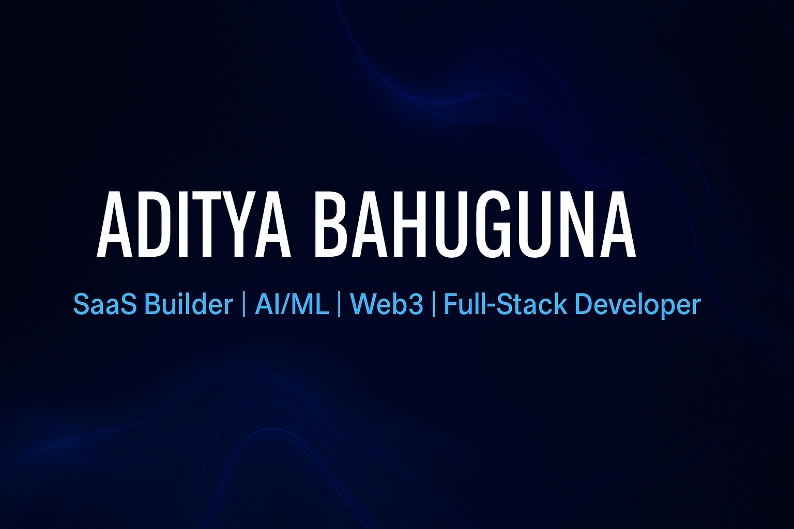

<!-- START - Profile README -->

<!-- Banner -->

  

<h1 align="center">👋 Hi, I'm Aditya Bahuguna</h1>
<h3 align="center">
  B.Tech CSE (AI & ML) Student | Passionate about SaaS, AI/ML, and Web3
</h3>

  I'm a first-year Computer Science student driven by a deep passion for building 
  <strong>scalable SaaS products</strong>, exploring <strong>AI/ML</strong> technologies, and diving into the future of <strong>Web3</strong>.  
  I love solving real-world problems through technology and will soon be sharing my first major projects here. 🚀

---

### 🌱 Currently Learning
- **Full-Stack Web Development** (React, MERN)
- **AI/ML Foundations** – Machine Learning, Deep Learning
- **Blockchain & Web3 Fundamentals**
- **SaaS Development** – Scalable, production-ready apps

---

### 🧰 Tech Stack

  
  
  
  
  
  
  
  
  
  

---

### 🤝 Let's Collaborate
I’m open to collaborating on:
- 🌐 **SaaS Products** – Scalable and real-world solutions
- 🤖 **AI/ML Applications** – Data-driven innovations
- 🔗 **Web3 Projects** – Blockchain-based technologies
- ⚡ **Full-Stack Web Apps**

---

### ✉️ Connect With Me

  
  
  
  

---

  ✨ <em>"Learning. Building. Growing — one commit at a time."</em> ✨

<!-- END - Profile README -->
